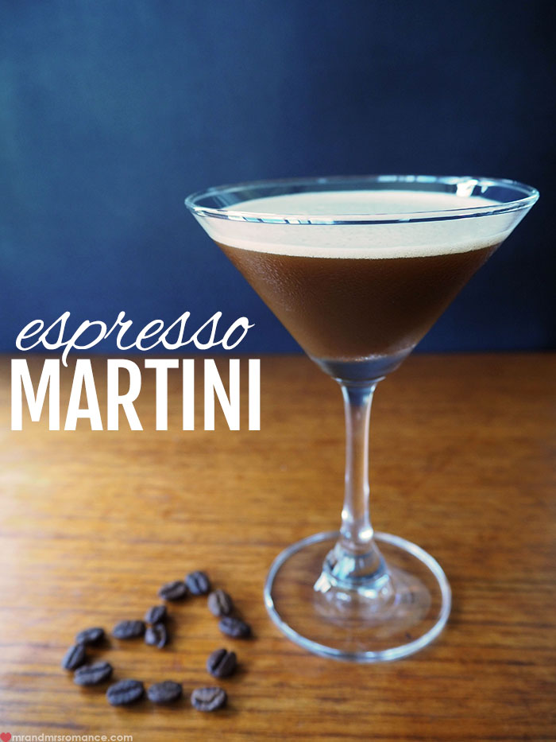

<!-- section start -->

<!-- attr: {id: 'title', class: 'slide-title', hasScriptWrapper: true} -->
# Team Espresso-Martini
## Databases Teamwork Project
<!--  -->

    
Databases

    
Telerik Software Academy

    <a href="http://academy.telerik.com" class="signature-link">http://academy.telerik.com</a>

<!-- section start -->
<!-- attr: { showInPresentation:true, style:'font-size: 0.7em' } -->

# Captain Marvel Members

| Name | TALS | GitHub |
| :------------- | :------------------- | :------------------------------------------|
| Кристиян Гериловски  | Gerilovski       | [kgerilovski](https://github.com/kgerilovski)                   |
| Мариан Николов   | Marian_Nikolov | [MarianNikolov](https://github.com/MarianNikolov)       |
| Петя Спасова    | pspassova  | [pspassova](https://github.com/pspassova)         |
| Росица Бъндева | rossi.bundeva  | [RossyB](https://github.com/RossyB)         |
| Христо Тодоров | todorovh    | [shakuu](https://github.com/shakuu)                 |

<!-- section start -->

<!-- attr: {id: 'table-of-contents'} -->
# Live Demo

<!-- section start -->

<!-- attr: {id: 'questions', class: 'slide-questions', showInPresentation: true} -->
# Database Transactions Concepts
## Questions
